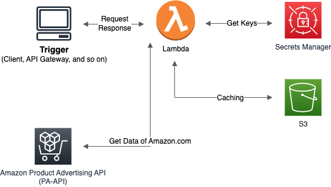

# pa-api-v5-lambda

Retrieve Amazon Associate data using AWS Signature v5.
The code is automatically deployed to an AWS Lambda Function.

## Infrastructure

- AWS
  - Trigger : Client, API Gateway and so on.
  - Lambda
  - S3
  - Secrets Manager

## Initial setting of keys
### Github Actions
Choose Setting in github repository.

`Security > Secrets > Actions`

|key|detail|
|-|-|
|AWS_REGION|The region hosting AWS Lambda|
|AWS_ROLE_ARN|The role that granted lambda:UpdateFunctionCode policy|
|AWS_LAMBDA_FUNCTION_ARN|The lambda function name to be deployed|